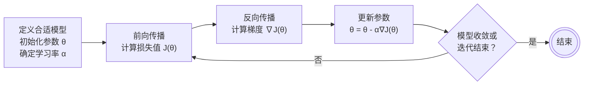

# 神经网络与深度学习

人工智能的强大能力建立在一系列严谨的数学原理和算法之上，理解这些原理和算法是解开人工智能黑盒的关键。首先，设计一个神经网络模型，其中多参数的层级结构和非线性的激活函数为求解问题提供无限可能，然而手动调节这些参数找出这个可能并不可行；更可行的手段是通过定义一个损失函数，在已知的数据上计算损失值，再利用这个损失值自动更新和训练这些参数，使得损失值越来越小，这个过程就称为学习，这种学习方法就称为梯度下降，反向传播是梯度下降在神经网络中的具体实现算法，而优化器确保学习过程又快又好，正则化确保学习效果稳健可靠。

|    输入层    | 隐藏层                                                        | 隐藏层                                                            | $\cdots$ | 隐藏层                                                                  | $\cdots$ | 输出层                                                                  |
| :----------: | ------------------------------------------------------------- | ----------------------------------------------------------------- | :------: | ----------------------------------------------------------------------- | :------: | ----------------------------------------------------------------------- |
|              | $\mathbf{z} ^ 1 = \mathbf{W} ^ 1 \mathbf{x} + \mathbf{b} ^ 1$ | $\mathbf{z} ^ 2 = \mathbf{W} ^ 2 \mathbf{a} ^ 1 + \mathbf{b} ^ 2$ | $\cdots$ | $\mathbf{z} ^ l = \mathbf{W} ^ l \mathbf{a} ^ {l - 1} + \mathbf{b} ^ l$ | $\cdots$ | $\mathbf{z} ^ L = \mathbf{W} ^ L \mathbf{a} ^ {L - 1} + \mathbf{b} ^ L$ |
| $\mathbf{x}$ | $\mathbf{a} ^ 1 = \sigma ^ 1 (\mathbf{z} ^ 1)$                | $\mathbf{a} ^ 2 = \sigma ^ 2 (\mathbf{z} ^ 2)$                    | $\cdots$ | $\mathbf{a} ^ l = \sigma ^ l (\mathbf{z} ^ l)$                          | $\cdots$ |                                                                         |

上表是一个基本的前馈神经网络（FNN）架构，可以看到这个 FNN 共有 $L$ 层的层级结构，展示了输入层 $\mathbf{x}$ 经过多个隐藏层的线性变换 $\mathbf{z} ^ l = \mathbf{W} ^ l \mathbf{a} ^ {l - 1} + \mathbf{b} ^ l$ 与非线性激活 $\mathbf{a} ^ l = \sigma ^ l (\mathbf{z} ^ l)$，最终通向输出层 $\mathbf{z} ^ L = \mathbf{W} ^ L \mathbf{a} ^ {L - 1} + \mathbf{b} ^ L$ 的前向传播过程。我们将以这个 FNN 的层级结构及数学表示为基础，介绍梯度下降、反向传播、损失函数等内容，了解如何将一个“静态”的神经网络转化为一个“动态”的学习系统。[看似简单的 FNN 是 RNN/CNN/Transformer 等复杂架构的基础](https://github.com/ngolin/AttentionIsAllYouNeed)。因此，理解了 FNN 的学习过程，也就为理解其他更为复杂的架构扫除障碍。我们先明确一下各个数学符号的含义：

|       符号       | 含义                      |                  定义域                   | 说明                                                                                                                                                                                                                                            |
| :--------------: | ------------------------- | :---------------------------------------: | ----------------------------------------------------------------------------------------------------------------------------------------------------------------------------------------------------------------------------------------------- |
|       $l$        | 层索引                    |            $\{1, 2, ..., L\}$             | $l = 1$ 指第一个隐藏层, $l = L$ 指最后的输出层, $L$ 为总层数                                                                                                                                                                                    |
| $\mathbf{W} ^ l$ | 第 $l$ 层的权重矩阵       | $\mathbb{R} ^ {n ^ l \times n ^ {l - 1}}$ | 其中 $n ^ l$ 是第 $l$ 层的神经元个数, $n ^ {l - 1}$ 是第 $l - 1$ 层的神经元个数, $n ^ 0$ 是输入 $\mathbf{x}$ 的特征维度数；矩阵元素 $W ^ l _ {jk}$ 表示第 $l - 1$ 层第 $k$ 个神经元到第 $l$ 层第 $j$ 个神经元的连接权重                         |
| $\mathbf{b} ^ l$ | 第 $l$ 层的偏置向量       |          $\mathbb{R} ^ {n ^ l}$           | 偏置元素 $b ^ l _ j$ 表示第 $l$ 层第 $j$ 个神经元的偏置水平                                                                                                                                                                                     |
| $\mathbf{z} ^ l$ | 第 $l$ 层的线性变换结果   |          $\mathbb{R} ^ {n ^ l}$           | 计算方式为 $\mathbf{z} ^ l = \mathbf{W} ^ l \mathbf{a} ^ {l - 1} + \mathbf{b} ^ l$                                                                                                                                                              |
| $\mathbf{a} ^ l$ | 第 $l$ 层的非线性激活输出 |          $\mathbb{R} ^ {n ^ l}$           | 计算方式为 $\mathbf{a} ^ l = \sigma ^ l(\mathbf{z} ^ l)$，其中 $\mathbf{a} ^ 0$ 定义为 $\mathbf{x}$, $\sigma ^ l$为第 $l$ 层使用的激活函数（如 Sigmoid, ReLU, Tanh 等），由于输出层通常不定义激活函数, $\mathbf{a} ^ L$ 定义为 $\mathbf{z} ^ L$ |
|       $C$        | 损失值                    |           $\mathbb{R}_{\geq 0}$           | 不同的任务类型选用不同的损失函数，如分类任务 $C = \text{CrossEntropy}(\mathbf{z} ^ l, \mathbf{y})$，回归任务 $C = \text{MSE}(\mathbf{z} ^ l, \mathbf{y})$，其中 $\mathbf{y}$ 是 $\mathbf{x}$ 的真实标签                                         |

以上数学符号都遵循一定的惯例，加粗表示向量，如 $\mathbf{x}, \mathbf{y}, \mathbf{a}, \mathbf{z}$（某些环境下可能显示不明显）；加粗大写字母表示矩阵，如 $\mathbf{W}$；普通字重表示标量，如 $l, L, j, k, C$；上标表示层索引，下标表示该层神经元索引，如 $W ^ l _ {jk}, b ^ l _ j, a ^ l _ j, z ^ l _ j$。明辨数学符号才能读懂数学推导，读懂数学推导才能理解数学原理。以下数学推导是 2020 年我在 HW 工作时阅读 [Neural Networks and Deep Learning](http://neuralnetworksanddeeplearning.com/chap2.html) 的总结。当时我们每天埋首工作到半夜，以为干着不得了的事。一晚有个同事突然抬头问，“神经网络是怎么学习的？为什么跑跑数就会学习？”我感觉头脑一片空白，于是决心深入学习。

## 一、梯度下降

我那个同事的疑问包含两方面，一是模型如何进行学习，二是模型为何能够学习。首先，模型通过训练进行学习。模型如同运动员，需要经过充分的训练才能发挥潜能；不同的任务也必须选择与之相匹配的模型，否则就像让武大郎去跳高，再怎么训练也是白费力气。训练要一轮轮迭代推进，每一轮的训练效果也要仔细评估，反馈到训练的每个环节中，才能有所进步。理想情况下，每轮进步一点点，直至稳定发挥最佳效果。在模型训练中，训练过程通常分多个 epoch, 每个 epoch 又包含多个 batch, 训练效果通过损失函数来反馈。这种训练方法称为梯度下降法，整体流程如下：

其次，模型因其结构决定功能。

## 二、反向传播

**如何减小损失(_loss_)?** 根据全微分定义，当 $W ^ l _ {jk} \to 0$, $b ^ l _ j \to 0$ 时, $\Delta C \to \sum \limits _ l\sum \limits _ j \left ( \sum \limits _ k \frac{\partial C}{\partial W ^ l _ {jk}} \Delta W ^ l _ {jk} + \frac{\partial C}{\partial b ^ l _ j} \Delta b ^ l _ j \right )$；若取 $\Delta W ^ l _ {jk} = - \eta \frac{\partial C}{\partial W ^ l _ {jk}}$, $\Delta b ^ l _ j = - \eta \frac{\partial C}{\partial b ^ l _ j}$, 则有：

$$
\Delta C \approx \sum_l\sum_j\left(\sum_k\frac{\partial C}{\partial W^l_{jk}}\Delta W^l_{jk} + \frac{\partial C}{\partial b^l_j}\Delta b^l_j\right)
= -\eta\sum_l\sum_j\left(\sum_k\left(\frac{\partial C}{\partial W^l_{jk}}\right)^2 + \left(\frac{\partial C}{\partial b^l_j}\right)^2\right)
\leqslant 0
$$

其中 $\eta$ 是一个很小的正数常量，是一个*超参数*，称为学习率(learning rate).

**如何求解 $\frac{\partial C}{\partial W^l_{jk}}$ 和 $\frac{\partial C}{\partial b^l_j}$？**

已知 $z ^ l _ j = \sum \limits _ k W ^ l _ {jk} a ^ {l - 1} _ k + b ^ l _ j$, 选取中间变量 $\delta ^ l _ j \equiv \frac{\partial C}{\partial z ^ l _ j}$, 只要求解 $\delta ^ l _ j$, 即可求解 $\frac{\partial C}{\partial W ^ l _ {jk}}$ 和 $\frac{\partial C}{\partial b ^ l _ j}$, 而 $\delta ^ l _ j$ 相对好求解。 它们的关系如下：

$$
\begin{aligned}\frac{\partial C}{W^l_{jk}} &= \frac{\partial C}{\partial z^l_j}\frac{\partial z^l_j}{\partial W^l_{jk}} = \delta^l_j\frac{\partial \left(\sum\limits_kW^l_{jk}a^{l-1}_k + b^l_j\right)}{\partial W^l_{jk}} = \delta^l_ja^{l-1}_k\\
\frac{\partial C}{\partial b^l_j} &= \frac{\partial C}{\partial z^l_j}\frac{\partial z^l_j}{\partial b^l_j} = \delta^l_j\frac{\partial \left(\sum\limits_kW^l_{jk}a^{l-1}_k + b^l_j\right)}{\partial b^l_j} = \delta^l_j\end{aligned}
$$

写成矩阵的形式：

$$
\frac{\partial C}{\partial \mathbf W^l} = \begin{pmatrix}\delta^l_1a^{l-1}_1 & \delta^l_1a^{l-1}_2 & \cdots & \delta^l_1a^{l-1}_k \\
\delta^l_2a^{l-1}_1 & \delta^l_2a^{l-1}_2 & \cdots & \delta^l_2a^{l-1}_k \\
\vdots & \vdots & \ddots & \vdots \\
\delta^l_ja^{l-1}_1 & \delta^l_ja^{l-1}_2 & \cdots & \delta^l_ja^{l-1}_k\end{pmatrix} = \boldsymbol \delta^l(\mathbf a^{l-1})^T, \quad
\frac{\partial C}{\partial \mathbf b^l} = \begin{pmatrix}\delta^l_1 \\
\delta^l_2 \\
\vdots \\
\delta^l_j\end{pmatrix} = \boldsymbol \delta^l
$$

**接下来如何求解 $\boldsymbol \delta^l$呢？**

$\boldsymbol \delta^L$ 是比较好求解的：

$$\boldsymbol \delta^L = (\nabla \mathbf a^L)^T\frac{\partial C}{\partial \mathbf a^L}$$

而 $\boldsymbol \delta^{l-1}$ 与 $\boldsymbol \delta^l$ 的关系也不难发现：

$$\delta^{l-1}_k = \frac{\partial C}{\partial z^{l-1}_k} = \sum_j\frac{\partial C}{\partial z^l_j}\frac{\partial z^l_j}{\partial a^{l-1}_k}\frac{\partial a^{l-1}_k}{\partial z^{l-1}_k} = \sum_j\delta^l_j\frac{\partial\left(\sum\limits_kW^l_{jk}a^{l-1}_k + b^l_j\right)}{\partial a^{l-1}_k}\frac{\partial a^{l-1}_k}{\partial z^{l-1}_k} = \sum_j\delta^l_jW^j_{jk}\nabla z^{l-1}_k = \sum_jW^j_{jk}\delta^l_j\nabla z^{l-1}_k$$

写成矩阵的形式：

$$
\boldsymbol\delta^{l-1} = \begin{pmatrix}\delta^{l-1}_1\\
\delta^{l-1}_2\\
\vdots\\
\delta^{l-1}_k\end{pmatrix} = \begin{pmatrix}\sum\limits_jW^j_{j1}\delta^l_j\nabla z^{l-1}_1\\
\sum\limits_jW^j_{j2}\delta^l_j\nabla z^{l-1}_2\\
\vdots\\
\sum\limits_jW^j_{jk}\delta^l_j\nabla z^{l-1}_k\end{pmatrix} = (\mathbf W^l)^T\boldsymbol\delta^l\odot\nabla\mathbf z^{l-1}
$$

总结一下，可得反向传播(Backpropagation)的更新流程：

$$
\mathbf W^l \gets \mathbf W^l - \eta\frac{\partial C}{\partial\mathbf W^l},\quad
\mathbf b^l \gets \mathbf b^l - \eta\frac{\partial C}{\partial\mathbf b^l}
$$

## 三、损失函数

分类问题和回归问题种 $\mathbf a^L$ - $C$ 的黄金组合及其 $\boldsymbol \delta^L$:

|          |                                                                                      $C$                                                                                      |              $\boldsymbol \delta^L$              |
| :------: | :---------------------------------------------------------------------------------------------------------------------------------------------------------------------------: | :----------------------------------------------: |
| 分类问题 | $C = \text{CrossEntropy}(\mathbf{z} ^ L) = -\ln a^L_{argmax\ \mathbf y}, \quad \mathbf a^L = \text{Softmax}(\mathbf{z} ^ L) = \frac{e^{\mathbf z^L}}{\sum\limits_ie^{z^L_i}}$ | $\boldsymbol \delta^L = \mathbf a^L - \mathbf y$ |
| 回归问题 |                              $C = \text{MSE}(\mathbf{z} ^ L) = \frac{(\mathbf a ^ L - \mathbf y) ^ 2}{2}, \quad \mathbf a ^ L = \mathbf{z} ^ L$                               | $\boldsymbol \delta^L = \mathbf a^L - \mathbf y$ |

## 四、激活函数

如果 Output function 为 $a_i^L = \frac{1}{1 + e^{-z_i^L}}$, Loss function 为 $C = \frac{(a_i^L - y_i^L)^2}{2}$, 则：

$$\delta_i^L = \frac{\partial C}{\partial z_i^L} = \frac{\partial C}{\partial a_i^L}\frac{\partial a_i^L}{\partial z_i^L} = (a_i^L - y_i^L)a_i^L(1 - a_i^L)$$

由此可知, $a_i^L \to 0$ 或 $a_i^L \to 1$ 时, $\delta_i^L \to 0$, 也就是损失越大学习越慢。

## 五、优化器

## 六、正则化
